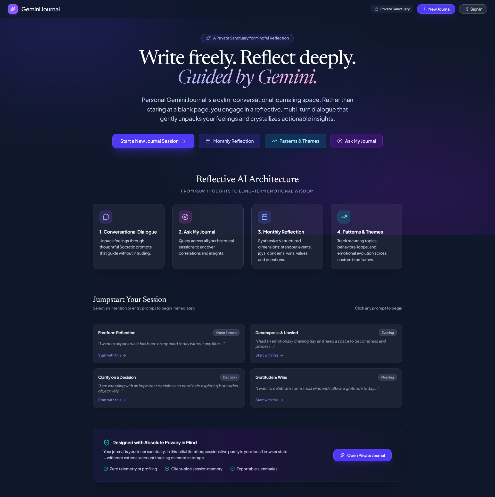
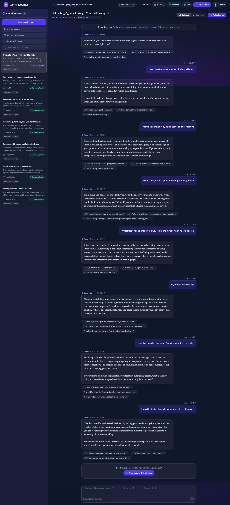
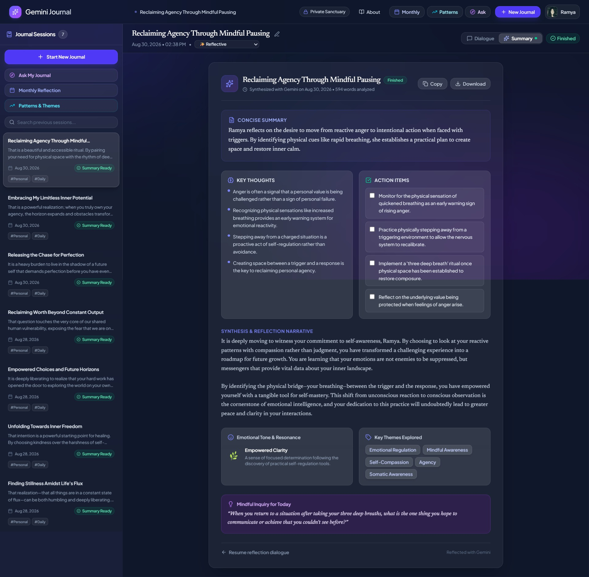
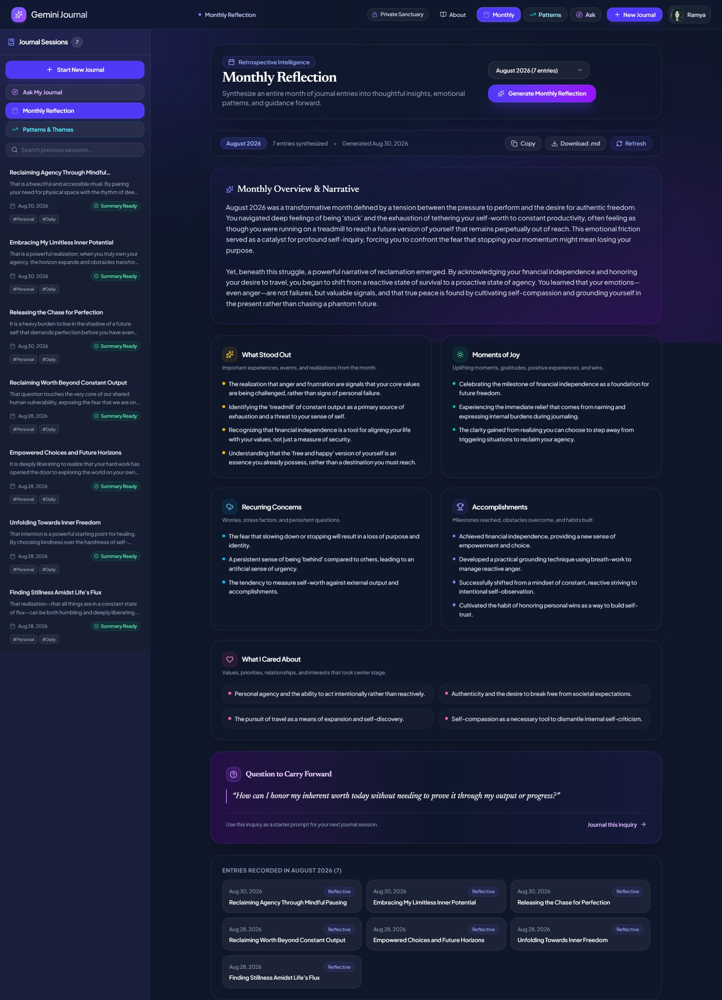
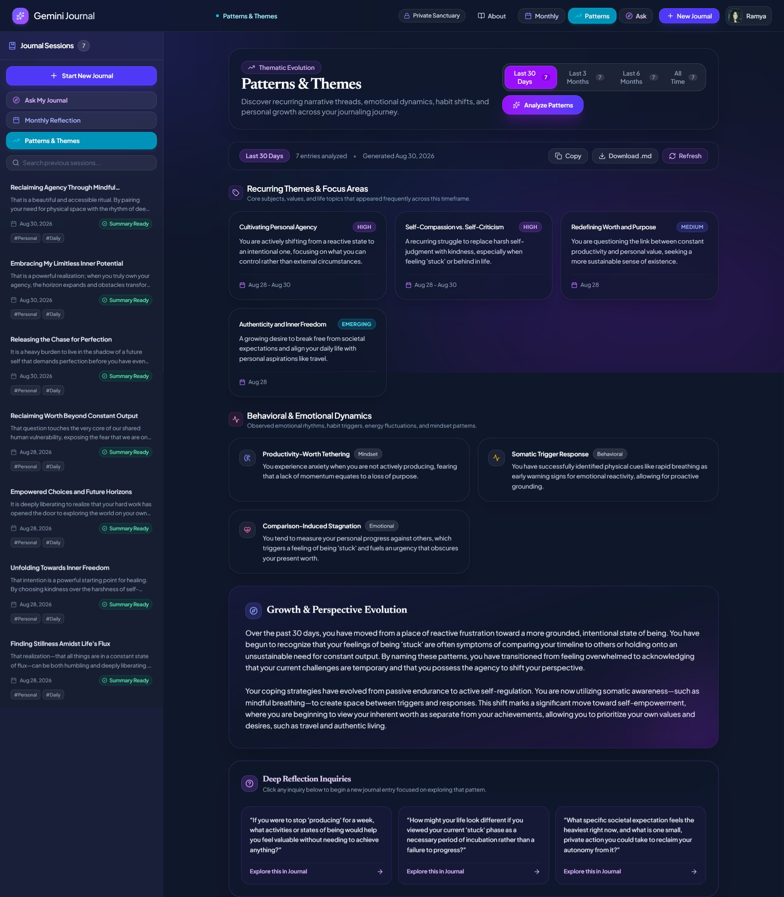

# Personal Gemini Journal

> An AI-assisted personal journaling platform that doesn't just store your thoughts, but helps you understand them, connect past experiences, and identify recurring patterns over time.

[](https://cloud.google.com/run)
[](https://ai.google.dev/)
[](https://firebase.google.com/)
[](https://cloud.google.com/secret-manager)
[](https://www.typescriptlang.org/)
[](https://react.dev/)
[](https://tailwindcss.com/)

---

## 📑 Table of Contents
1. [What Personal Gemini Journal Is](#-what-personal-gemini-journal-is)
2. [Why I Built This](#-why-i-built-this)
3. [See It in Action](#-see-it-in-action)
4. [Core Experience](#-core-experience)
5. [Challenge Highlights](#-challenge-highlights)
6. [Built With](#%EF%B8%8F-built-with)
7. [Architecture](#%EF%B8%8F-architecture)
8. [Key Engineering Decisions](#-key-engineering-decisions)
9. [Security by Design](#-security-by-design)
10. [How Gemini Is Used](#-how-gemini-is-used)
11. [How Google AI Studio Was Used](#-how-google-ai-studio-was-used)
12. [Local Development](#-local-development)
13. [Firebase Setup Guide](#-firebase-setup-guide)
14. [Google Cloud Secret Manager Setup](#-google-cloud-secret-manager-setup)
15. [Cloud Run Deployment Guide (`dev-tutorial=cloud-run-ai-challenge`)](#%EF%B8%8F-cloud-run-deployment-guide-dev-tutorialcloud-run-ai-challenge)
16. [Testing & Verification](#-testing--verification)
17. [Known Limitations](#-known-limitations)
18. [Future Roadmap](#-future-roadmap)
19. [License](#-license)

---

## 🌟 What Personal Gemini Journal Is

**Personal Gemini Journal** is an interactive, private self-reflection web application that transforms traditional one-way journaling into an active, guided reflection experience.

Most digital journals function as passive text storage: you write an entry, save it to a database, and rarely read it again. Personal Gemini Journal changes this dynamic by combining reflective conversational AI with structured longitudinal analysis:

- **Active Reflection Companion**: Instead of a blank page, Gemini engages in supportive Socratic dialogue, asking gentle follow-up questions to help you unpack complex feelings.
- **Multidimensional Synthesis**: At the end of every session, Gemini extracts structured takeaways, actionable commitments, emotional sentiment, and thematic tags.
- **Cross-Entry Discovery**: Tools like **Ask My Journal**, **Monthly Reflection**, and **Patterns & Themes** analyze your historical reflections to uncover recurring themes, emotional shifts, and long-term personal growth.
- **Privacy & Security by Design**: Built on Google Cloud Run with strict UID-scoped Cloud Firestore isolation, Firebase Authentication token verification, and credential access via Google Cloud Secret Manager.

The application was developed and published using **Google AI Studio** as part of the Google Cloud Run & Gemini AI Challenge.

---

## 💡 Why I Built This

Traditional journaling is valuable for capturing what happened, but it often stops at transcription. People write down their thoughts when they feel overwhelmed, but they rarely have the time or tools to:
1. Challenge their own assumptions in the moment.
2. Connect current struggles with past experiences where they navigated similar challenges.
3. Step back to observe recurring behavioral loops and emotional patterns over weeks or months.

This project was built to explore what happens when software acts as an empathetic mirror rather than an archive cabinet.

```
┌───────────┐      ┌─────────────┐      ┌────────────┐      ┌──────────────┐
│   WRITE   │ ───► │   REFLECT   │ ───► │  REVISIT   │ ───► │   DISCOVER   │
│ Express   │      │ Socratic AI │      │ Cross-Entry│      │ Longitudinal │
│ thoughts  │      │ follow-ups  │      │ synthesis  │      │   patterns   │
└───────────┘      └─────────────┘      └────────────┘      └──────────────┘
```

By connecting daily reflections into a broader narrative, users can gain genuine perspective on their personal evolution.

---

## 📸 See It in Action

The following screenshots illustrate the primary user journeys and analytical capabilities:

### 1. Clean Arrival & Protected Workspace

*The landing state greets users with a focused, distraction-free environment. Full navigation and private journal history unlock upon authentication.*

---

### 2. Guided Conversational Journaling

*Real-time conversational reflection powered by Gemini, featuring context-aware starter chips, active word count, session timers, and gentle Socratic inquiry.*

---

### 3. Session Synthesis & Takeaways

*Structured post-session summary distilling the dialogue into an executive summary, sentiment scoring, core realizations, action commitments, and auto-generated tags.*

---

### 4. Monthly Retrospective

*A structured retrospective analyzing entries for a selected calendar month across standout events, gratitude, challenges, milestones, and forward-looking questions.*

---

### 5. Longitudinal Patterns & Themes

*Multi-timeframe trend detector synthesizing recurring themes, behavioral loops, mindset evolution, and recommended reflection prompts across 30, 90, 180 days, or all time.*

---

## ✨ Core Experience

The application centers around four main capabilities:

### 1. Guided / Conversational Journaling
- **Empathetic Guide**: Powered by Gemini, the conversational engine provides grounded, non-judgmental guidance designed to help users articulate what is underneath their thoughts.
- **Smart Completion Chips**: Context-aware prompts offer starting points. Sentence starters ending with ellipses (`...`) auto-populate the input field for easy completion, while complete prompts submit instantly.
- **Session Focus**: Real-time timer, word counter, and mood indicator help users stay present during their reflection practice.

### 2. Ask My Journal (Cross-Entry Synthesis)
- **Natural-Language Journal Querying**: Users can ask exploratory questions about their past reflections (e.g., *"What recurring concerns have I had about my work projects?"* or *"What was I grateful for this month?"*).
- **Source Citations**: Every answer includes references to specific journal sessions with dates, titles, and relevant excerpt snippets.
- **Visual Progress Pipeline**: Clear multi-stage progress indicators show retrieval, theme extraction, and citation synthesis in real time.
- *Note: In the current release, Ask My Journal synthesizes across a window of recent journal transcripts directly in the prompt context.*

### 3. Monthly Reflection
- **Calendar Month Selection**: Users can choose any recorded month to generate a comprehensive retrospective.
- **6-Dimension Structured Synthesis**:
  - **Summary Overview**: Narrative summary of the month's emotional rhythm.
  - **What Stood Out**: Key experiences and turning points.
  - **Moments of Joy & Gratitude**: Uplifting moments and gratitude entries.
  - **Recurring Concerns & Challenges**: Friction points or worries navigated.
  - **Accomplishments & Wins**: Milestones reached and obstacles overcome.
  - **What I Cared About**: Shifting values, priorities, and relationships.
  - **Question to Carry Forward**: One deep question to guide the upcoming month.

### 4. Patterns & Themes
- **Multi-Timeframe Scope**: Analyze reflections across **Last 30 Days**, **Last 3 Months**, **Last 6 Months**, or **All Time**.
- **Thematic Frequency & Prominence**: Highlights recurring topics with assigned prominence levels (`High`, `Medium`, `Emerging`) and session references.
- **Behavioral & Mindset Dynamics**: Identifies helpful routines versus unhelpful loops.
- **Growth Narrative & Questions**: Summarizes emotional progression over time and provides personalized prompts for future sessions.

---

## 🏆 Challenge Highlights

This project demonstrates practical full-stack AI application development on Google Cloud:

- **Google AI Studio**: Used throughout the project lifecycle for prompt engineering, schema modeling, rapid full-stack iteration, and security hardening.
- **Google Gemini API**: Implemented via `@google/genai` utilizing structured JSON schemas for reliable, type-safe frontend rendering.
- **Google Cloud Run**: Serverless container hosting running Express and Vite middleware on port 3000.
- **Google Cloud Secret Manager**: Production API key retrieval using **Application Default Credentials (ADC)** with in-memory TTL caching and log sanitization.
- **Firebase Authentication**: Client-side Google Identity login paired with server-side JWT verification using `firebase-admin/auth`.
- **Google Cloud Firestore**: Fine-grained, path-based security rules enforcing strict per-UID data isolation (`/users/{userId}/journals/{journalId}`).
- **Input Bounding & Protection**: Express payload limits, request validation, and Firestore rule constraints preventing storage abuse.

---

## 🛠️ Built With

| Component | Technology | Description |
| :--- | :--- | :--- |
| **Frontend UI** | [React 19](https://react.dev/) + [TypeScript 5.8](https://www.typescriptlang.org/) | Single-page application with modular component architecture |
| **Styling & Icons** | [Tailwind CSS v4](https://tailwindcss.com/) + [Lucide React](https://lucide.dev/) | Custom responsive dark-theme design system with accessible contrast |
| **Animations & Markdown** | [Motion](https://motion.dev/) + [React-Markdown](https://github.com/remarkjs/react-markdown) | Transition animations and formatted Markdown rendering |
| **Backend Server** | [Express.js](https://expressjs.com/) on [Node.js 20 LTS](https://nodejs.org/) | Authenticated API proxy and production static asset server |
| **Build Tooling** | [Vite 6](https://vitejs.dev/) + [esbuild](https://esbuild.github.io/) | Fast client bundling and self-contained CommonJS server compilation |
| **AI Models** | [Gemini 2.5 Flash / 3.1 Flash Lite](https://ai.google.dev/) via `@google/genai` | Empathetic chat, structured session synthesis, and journal search |
| **Identity & Database** | [Firebase Auth](https://firebase.google.com/docs/auth) & [Cloud Firestore](https://firebase.google.com/docs/firestore) | Google Identity sign-in and real-time document persistence |
| **Secret Management** | [Google Cloud Secret Manager](https://cloud.google.com/secret-manager) | IAM-governed runtime credential access via Application Default Credentials |
| **Container Compute** | [Google Cloud Run](https://cloud.google.com/run) | Serverless production container deployment |

---

## 🏗️ Architecture

### High-Level Architecture

```
User (Browser)
      │
      ▼
React 19 Client ──(Google Sign-In)──► Firebase Authentication
      │                                       │
      │ (Bearer ID Token)                     ▼
      ▼                              Verified Identity (UID)
Cloud Run API (Express Server)
      │
      ├──────────────────────┬──────────────────────┐
      ▼                      ▼                      ▼
Cloud Firestore        Google Gemini API      Cloud Secret Manager
(Private Journals      (Structured JSON       (GEMINI_API_KEY via
 per User UID)          Synthesis & Chat)      ADC & IAM Roles)
```

### Detailed Architecture

```
                                  ┌────────────────────────────────────────────────────────┐
                                  │                  User Web Browser                      │
                                  │  - React 19 Client (SPA)                               │
                                  │  - Tailwind CSS v4 & Lucide Icons                      │
                                  │  - Firebase Auth Client SDK (Google Sign-In)           │
                                  └───────────┬────────────────────────────────┬───────────┘
                                              │                                │
                                  HTTPS (Bearer ID Token)               Direct Firestore Sync
                                              │                                │
                                              ▼                                ▼
                       ┌──────────────────────────────────────────────┐ ┌────────────────────────────────┐
                       │            Google Cloud Run Service          │ │       Google Cloud Firestore   │
                       │  ┌────────────────────────────────────────┐  │ │  ┌───────────────────────────┐ │
                       │  │       Express.js Server (Port 3000)    │  │ │  │ /users/{userId}/journals  │ │
                       │  │  - Static Asset Delivery (dist/)       │  │ │  │   /{journalId}            │ │
                       │  │  - Firebase Admin ID Token Auth Guard  │  │ │  │                           │ │
                       │  │  - JSON Schema Validation & Routing    │  │ │  │ Enforced by Granular      │ │
                       │  └───────────────────┬────────────────────┘  │ │  │ Firestore Security Rules  │ │
                       └──────────────────────┼───────────────────────┘ └───────────────────────────────┘
                                              │
                         ┌────────────────────┴────────────────────┐
                         ▼                                         ▼
          ┌─────────────────────────────┐           ┌─────────────────────────────┐
          │  Google Cloud Secret Manager│           │      Google Gemini API      │
          │  - Secret: GEMINI_API_KEY   │           │  - Model: gemini-2.5-flash  │
          │  - Accessed via ADC (IAM)   │           │    & gemini-3.1-flash-lite  │
          │  - 1-Hour In-Memory Cache   │           │  - Structured JSON Output   │
          │  - Automatic Log Redaction  │           │  - Markdown Formatting      │
          └─────────────────────────────┘           └─────────────────────────────┘
```

---

## 🧠 Key Engineering Decisions

### 1. Why Cloud Firestore for Data Isolation?
- **Hierarchical Path Ownership**: Storing user documents under `/users/{userId}/journals/{journalId}` allows Firestore security rules to match `request.auth.uid == userId` directly on the document path.
- **Zero Cross-Tenant Leakage**: Unauthenticated requests or requests targeting another user's collection are rejected at the database engine level, independent of application code.
- **Real-Time Client Sync**: Real-time snapshot listeners (`onSnapshot`) keep the user's interface up to date without requiring polling.

### 2. Why Cloud Run with Server-Side Routing?
- **API Key Protection**: Browser clients never interact directly with the Gemini API or Secret Manager. All AI requests pass through the Express backend, keeping API credentials hidden.
- **Cryptographic Token Verification**: The backend validates the Firebase ID token before invoking any AI operations, ensuring unauthenticated or spoofed requests never consume Gemini API quota.

### 3. Why Google Cloud Secret Manager & ADC?
- **No Embedded Secrets**: Eliminates static API keys in code, configuration files, or container environment variables.
- **IAM-Bound Access**: Cloud Run uses its assigned service account identity through Application Default Credentials (ADC) to access `roles/secretmanager.secretAccessor`.
- **In-Memory TTL Caching**: The server caches the API key in memory for 1 hour to reduce Secret Manager API calls and latency during high-frequency journaling sessions.

### 4. Why Structured Gemini Responses (JSON Schemas)?
- **Predictable UI Rendering**: Utilizing `responseMimeType: 'application/json'` and strict `responseSchema` definitions guarantees that endpoints like `/api/journal/summarize`, `/api/journal/monthly-reflection`, and `/api/journal/patterns` return the exact fields required by the UI.
- **Empathetic Flexibility**: Gemini generates nuanced, contextual writing while adhering to a stable contract for sentiment scores, tags, and action items.

---

## 🔐 Security by Design

Security is implemented in depth across every tier of the application:

```
┌─────────────────────────────────────────────────────────────────────────────┐
│ 1. Client Tier: No secrets in frontend bundle; Google OAuth via Firebase     │
├─────────────────────────────────────────────────────────────────────────────┤
│ 2. Transport Tier: HTTPS everywhere; Bearer JWT attached on API requests    │
├─────────────────────────────────────────────────────────────────────────────┤
│ 3. API Guard Tier: Firebase Admin verifies token signature, issuer, & expiry│
├─────────────────────────────────────────────────────────────────────────────┤
│ 4. Secret Tier: Secret Manager via ADC; 1-hour cache; automatic log redaction│
├─────────────────────────────────────────────────────────────────────────────┤
│ 5. Data Tier: Firestore rules enforce UID-based ownership & schema bounds   │
└─────────────────────────────────────────────────────────────────────────────┘
```

### Firestore Security Rules (`firestore.rules`)
The Firestore security rules enforce path-based ownership matching the caller's Firebase Authentication UID (`request.auth.uid == userId`) and constrain request payload dimensions:

```javascript
rules_version = '2';
service cloud.firestore {
  match /databases/{database}/documents {
    function isAuthenticated() {
      return request.auth != null && request.auth.uid != null;
    }
    function isOwner(userId) {
      return isAuthenticated() && request.auth.uid == userId;
    }

    match /users/{userId} {
      allow read, write: if isOwner(userId);

      match /journals/{journalId} {
        allow read, delete: if isOwner(userId);
        allow create, update: if isOwner(userId)
          && request.resource.data.userId == request.auth.uid
          && request.resource.data.title.size() <= 200
          && request.resource.data.messages.size() <= 500;
      }
    }

    match /{document=**} {
      allow read, write: if false;
    }
  }
}
```

<details>
<summary><strong>🔍 Click to view Threat Model & Security Mitigations</strong></summary>

### Detailed Threat Model

| Threat | Impact | Mitigation Strategy |
| :--- | :--- | :--- |
| **Cross-User Data Access** | Unauthorized reading of another user's journal entries. | Path-based Firestore security rules (`isOwner(userId)`) combined with server-side Firebase Admin JWT token verification. |
| **API Key Theft / Leakage** | Gemini API quota theft or billing compromise. | Secrets stored in Cloud Secret Manager, fetched via ADC, cached in memory, and never sent to the browser. |
| **Prompt Injection / Manipulation** | Attempting to redirect the guide or extract prompts. | System instructions with strict framing, typed JSON schema validation, and defensive boundary delimiters. |
| **Denial of Storage / Oversized Payloads** | Flooding Firestore or the backend with oversized bodies. | Express JSON parser limited to 5MB; Firestore rules cap message count (≤ 500), title length (≤ 200 chars), and tag count (≤ 30). |
| **Log Exposure of Sensitive Credentials** | API keys or OAuth tokens leaking into Cloud Logging. | Custom regex sanitization layer (`sanitizeErrorMessage`) redacting `AIzaSy...`, `ya29...`, and Bearer tokens before logging. |

</details>

---

## 🤖 How Gemini Is Used

The application uses the `@google/genai` TypeScript SDK with **Gemini 2.5 Flash** and **Gemini 3.1 Flash Lite** across five specialized server endpoints:

1. **Conversational Guide (`/api/journal/chat`)**:
   - System prompt guides user through reflective Socratic dialogue.
   - Outputs conversational reply and 3 suggested completion starters.

2. **Session Synthesis (`/api/journal/summarize`)**:
   - Generates an executive summary, mood score (0–100), key realizations, action items, reflection narrative, and thematic tags.

3. **Cross-Entry Search (`/api/journal/ask`)**:
   - Ingests recent user journal transcripts and synthesizes answers to open-ended retrospective queries with specific journal citations.

4. **Monthly Retrospective (`/api/journal/monthly-reflection`)**:
   - Compiles monthly journal entries into a 6-dimension retrospective covering standout events, joys, concerns, achievements, evolving values, and future questions.

5. **Patterns & Themes (`/api/journal/patterns`)**:
   - Evaluates multi-timeframe entries (30 days to all time) for recurring topics, behavioral tendencies, emotional trajectories, and tailored prompts.

---

## 🛠️ How Google AI Studio Was Used

Google AI Studio was central to designing, developing, and refining the application:

1. **Explore**:
   - Prototyped the mindfulness companion persona and Socratic questioning style.
   - Tested system prompts to balance emotional validation with constructive self-discovery.
   - Modeled and refined structured JSON response schemas for synthesis, monthly retrospectives, and cross-entry search.

2. **Build**:
   - Iteratively implemented the React 19 UI, Tailwind CSS design system, and Express server-side routing.
   - Integrated the `@google/genai` SDK and established clean client-server communication.
   - Structured the Firestore data model and reactive UI listeners.

3. **Validate**:
   - Tested edge cases including empty sessions, single-sentence reflections, and long multi-turn conversations.
   - Verified that JSON schema validation prevented malformed model outputs from breaking UI components.
   - Tested offline fallback behaviors to ensure the UI handles connectivity disruptions gracefully.

4. **Harden**:
   - Designed and audited the Firestore security rules.
   - Implemented Google Cloud Secret Manager integration with ADC and error message sanitization.
   - Enforced server-side JWT verification using `firebase-admin/auth`.

5. **Extend**:
   - Added longitudinal reflection features: **Ask My Journal**, **Monthly Reflection**, and **Patterns & Themes** to transform daily reflections into long-term personal insights.

---

## 💻 Local Development

### Prerequisites
- **Node.js 20+ LTS**
- **npm 10+**
- A **Gemini API Key** (from [Google AI Studio](https://aistudio.google.com/))
- A **Firebase Project** with Authentication and Firestore enabled

### 1. Clone the Repository
```bash
git clone https://github.com/ramyatantry/personal-gemini-journal.git
cd personal-gemini-journal
npm install
```

### 2. Configure Environment Variables
Create a `.env` file in the project root:
```env
# Server Configuration
PORT=3000
NODE_ENV=development

# Gemini API Key (Local fallback when not using Secret Manager)
GEMINI_API_KEY=your_gemini_api_key_here

# Firebase Configuration (From Firebase Console Web App Config)
VITE_FIREBASE_API_KEY=your_firebase_api_key
VITE_FIREBASE_AUTH_DOMAIN=your_project.firebaseapp.com
VITE_FIREBASE_PROJECT_ID=your_firebase_project_id
VITE_FIREBASE_STORAGE_BUCKET=your_project.appspot.com
VITE_FIREBASE_MESSAGING_SENDER_ID=your_sender_id
VITE_FIREBASE_APP_ID=your_app_id
```

### 3. Run the Development Server
```bash
npm run dev
```
Open [http://localhost:3000](http://localhost:3000) in your browser.

---

## 🔥 Firebase Setup Guide

1. **Create a Firebase Project**:
   - Visit the [Firebase Console](https://console.firebase.google.com/) and create a project.
2. **Enable Google Authentication**:
   - Under **Build** ➔ **Authentication** ➔ **Sign-in method**, enable **Google**.
3. **Create a Firestore Database**:
   - Under **Build** ➔ **Firestore Database**, create a database in your preferred region.
4. **Deploy Security Rules**:
   ```bash
   npm install -g firebase-tools
   firebase login
   firebase deploy --only firestore:rules
   ```

---

## 🔒 Google Cloud Secret Manager Setup

To configure Secret Manager for production deployments:

1. **Enable the Secret Manager API**:
   ```bash
   gcloud services enable secretmanager.googleapis.com --project=YOUR_GCP_PROJECT_ID
   ```

2. **Create the Secret**:
   ```bash
   echo -n "YOUR_ACTUAL_GEMINI_API_KEY" | gcloud secrets create GEMINI_API_KEY \
     --data-file=- \
     --replication-policy="automatic" \
     --project=YOUR_GCP_PROJECT_ID
   ```

3. **Grant Secret Access to the Cloud Run Service Account**:
   ```bash
   PROJECT_NUMBER=$(gcloud projects describe YOUR_GCP_PROJECT_ID --format="value(projectNumber)")
   SERVICE_ACCOUNT="${PROJECT_NUMBER}-compute@developer.gserviceaccount.com"

   gcloud secrets add-iam-policy-binding GEMINI_API_KEY \
     --member="serviceAccount:${SERVICE_ACCOUNT}" \
     --role="roles/secretmanager.secretAccessor" \
     --project=YOUR_GCP_PROJECT_ID
   ```

---

## ☁️ Cloud Run Deployment Guide (`dev-tutorial=cloud-run-ai-challenge`)

Deploy the application directly to **Google Cloud Run**:

```
─────────────────────────────────────────────────────────────────────────────
Required Tutorial Tag: dev-tutorial=cloud-run-ai-challenge
─────────────────────────────────────────────────────────────────────────────
```

### Step 1: Configure gcloud
```bash
export PROJECT_ID="YOUR_GCP_PROJECT_ID"
export REGION="asia-southeast1" # or us-central1
export SERVICE_NAME="personal-gemini-journal"

gcloud config set project $PROJECT_ID
gcloud services enable run.googleapis.com cloudbuild.googleapis.com secretmanager.googleapis.com
```

### Step 2: Build & Deploy
Deploy directly using Google Cloud Buildpack:
```bash
gcloud run deploy $SERVICE_NAME \
  --source . \
  --region $REGION \
  --platform managed \
  --allow-unauthenticated \
  --port 3000 \
  --set-env-vars="GCP_PROJECT_ID=${PROJECT_ID},GEMINI_SECRET_NAME=GEMINI_API_KEY,NODE_ENV=production" \
  --labels=dev-tutorial=cloud-run-ai-challenge
```

### Step 3: Verify Deployment
Cloud Run will provide your service URL:
```
Service [personal-gemini-journal] revision has been deployed and is serving 100 percent of traffic.
```

---

## 🧪 Testing & Verification

### Code Quality & Build Checks
```bash
# Verify TypeScript compilation and type safety
npm run lint

# Verify full production build
npm run build
```

### Verification Checklist
- [x] **Zero Plaintext Secrets**: Verified no API keys or service account credentials are committed in source code.
- [x] **Secret Manager & ADC Integration**: Verified runtime secret retrieval via `@google-cloud/secret-manager`.
- [x] **Firestore Data Isolation**: Tested that unauthorized and cross-user read/write attempts to `/users/{otherUser}/journals` are rejected by security rules.
- [x] **Log Sanitization**: Verified that error logs redact API keys (`AIzaSy...`), OAuth tokens (`ya29...`), and Bearer headers.
- [x] **JWT Expiration & Auth Guards**: Verified that unauthenticated or expired token requests return `401 Unauthorized`.

---

## 📌 Known Limitations

- **Recent-Entry Analysis Window**: Ask My Journal, Monthly Reflection, and Patterns & Themes currently analyze up to 25–35 recent journal sessions in prompt context.
- **Authentication Dependency**: Full cross-device synchronization and AI-assisted reflection features require signing in with Google to enforce UID-isolated storage.
- **Informational Purpose**: AI-generated reflections and insights are intended solely for personal self-reflection and mindful awareness, not as medical, clinical, or professional mental-health advice.

---

## 🚀 Future Roadmap

- [ ] **Vector Search Retrieval (Vertex AI Vector Search)**: Scale Ask My Journal to large historical archives using embeddings.
- [ ] **Voice Journaling**: Real-time voice reflection using the Gemini Live API.
- [ ] **PDF & Markdown Export**: Formatted export for printing personal yearly reflection books.
- [ ] **Custom Reflection Templates**: User-defined guided journaling templates for gratitude, work retrospectives, or goal planning.

---

## 📄 License

Distributed under the MIT License. See `LICENSE` for more information.
